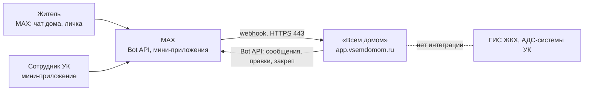
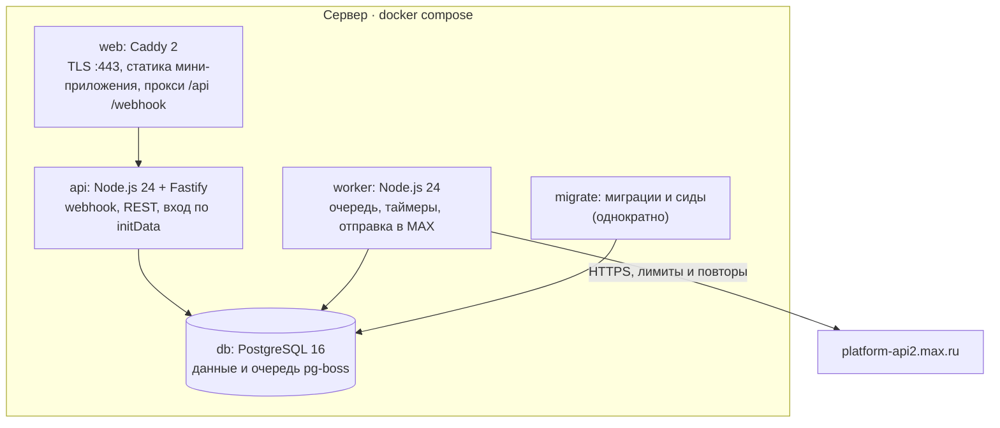

# Всем домом

Бот и мини-приложение для домового чата в MAX: когда в доме пропадает вода, тепло или свет, соседи отмечают аварию в одной карточке, видят сроки по нормативам и ответ УК, а после устранения получают итог для всего дома.

**Одна авария — одна карточка.**

> **Модельные данные.** Управляющая компания, дома, подъезды и телефоны АДС — вымышленные, в боте и API они помечены «Модельные данные». Нормативы (сроки, лимиты, ставки) — реальные: у каждой нормы основание, редакция, ссылка на первоисточник и дата проверки.

| Что | Где |
|---|---|
| Стенд | https://app.vsemdomom.ru — `/api/docs` (Swagger), `/api/v1/version`, `/health` |
| Контракт API | [`docs/api/openapi.yaml`](docs/api/openapi.yaml) (OpenAPI 3.1, версия 1.1.0), описание — [`docs/api/README.md`](docs/api/README.md) |
| Проверки DATA-API | [`docs/api/DATA-API.yaml`](docs/api/DATA-API.yaml) — цепочка запросов на доме-песочнице |
| Примеры сообщений бота | [`docs/EXAMPLES.md`](docs/EXAMPLES.md) — карточка во всех состояниях, вопрос, итог, личка |
| Данные и ПДн | [`docs/DATA.md`](docs/DATA.md) · развёртывание — [`docs/DEPLOY.md`](docs/DEPLOY.md) · проверки MAX — [`docs/MAX_CHECKS.md`](docs/MAX_CHECKS.md) · изменения — [`CHANGELOG.md`](CHANGELOG.md) |

## Содержание

1. [Назначение](#1-назначение)
2. [Основной сценарий](#2-основной-сценарий)
3. [Состав и архитектура](#3-состав-и-архитектура)
4. [Запуск одной командой](#4-запуск-одной-командой)
5. [Режимы работы](#5-режимы-работы)
6. [Переменные окружения](#6-переменные-окружения)
7. [Порты](#7-порты)
8. [Зависимости](#8-зависимости)
9. [Внешние сервисы и интеграции](#9-внешние-сервисы-и-интеграции)
10. [Работа с данными](#10-работа-с-данными)
11. [Тестовые данные](#11-тестовые-данные)
12. [Пошаговый сценарий проверки](#12-пошаговый-сценарий-проверки)
13. [Примеры ожидаемого поведения](#13-примеры-ожидаемого-поведения)
14. [Известные ограничения](#14-известные-ограничения)
15. [Остановка и повторный запуск](#15-остановка-и-повторный-запуск)

Дальше: [платформенный бонус](#платформенный-бонус-что-используем-сверх-минимума), [использование ИИ-агентов](#использование-ии-агентов-в-разработке), [разработка и тесты](#разработка-и-тесты).

## 1. Назначение

Во время аварии в доме главный вопрос жителей — знает ли УК и когда всё починят. Сейчас на него отвечает чат из десятков сообщений «у кого нет воды?» и занятый телефон диспетчерской. «Всем домом» собирает аварию в одну карточку прямо в чате дома: соседи, включая нанимателей, присоединяются кнопкой, сроки берутся из ПП № 416 и Правил № 354, УК отвечает один раз всему дому. После устранения дом получает хронологию и расчёт для заявления на перерасчёт.

Кто пользуется: жители (собственники, наниматели, члены семьи) — в чате дома и в личке с ботом; сотрудник УК — в мини-приложении; председатель совета дома — итог месяца и акт без исполнителя.

## 2. Основной сценарий

| # | Действие | Что происходит |
|---|---|---|
| 1 | Житель A сообщает об аварии: в панели дома «Сообщить об аварии» или в личке с ботом — вид (горячая вода), время начала, где (подъезд или весь дом) | Авария создана; в чат дома — карточка с первым сроком по нормативу; панель дома в закрепе обновлена |
| 2 | — | Авария видна УК в списке, самые срочные сверху |
| 3 | Житель A вводит номер заявки АДС и время | Событие в хронологии; сроки считаются от регистрации заявки |
| 4 | Жители B и C жмут в карточке свой подъезд | Счётчики «подъезд 2 — 2, подъезд 3 — 1»; каждому нажавшему — личное уведомление, видно только ему |
| 5 | УК: «Принято, ориентир 18:00» | Карточка правится (не новое сообщение); присоединившимся — сообщение в личку |
| 6 | УК: «Бригада на месте»; жители подтверждают или «Бригады нет» | Отметки жителей — в хронологии |
| 7 | УК: «Локализовано» → «Устранено» | В чат — вопрос «Горячая вода вернулась?» (второе новое сообщение) |
| 8 | B отвечает «Нет» | Статус «Расхождение»; B в личку — что делать: повторно в АДС, акт без исполнителя |
| 9 | B меняет ответ на «Да» (или истекает окно проверки) | Авария закрыта; итог — третьим сообщением, ответом на карточку |
| 10 | A открывает «Оформить перерасчёт», вводит сумму из квитанции | Превышение месячной нормы и расчёт по справочнику; заявление приходит A в личку; ФИО и телефон нигде не сохраняются |

На одну аварию бот пишет в чат не больше трёх новых сообщений: карточка, вопрос, итог. Всё остальное — правки карточки. В чате нет имён и номеров квартир — только число отметок по подъездам.

## 3. Состав и архитектура





| Контейнер | Роль |
|---|---|
| `web` | Caddy: сертификат Let's Encrypt с полной цепочкой (требование webhook MAX), статика мини-приложения, прокси на `api` |
| `api` | Принимает webhook MAX (секрет в заголовке, дедупликация, ответ 200 сразу), REST API мини-приложения, Swagger |
| `worker` | Обрабатывает события и таймеры, отправляет и правит сообщения в MAX с лимитами частоты и повторами |
| `migrate` | Миграции схемы и модельные данные, завершается |
| `db` | PostgreSQL: данные и очередь задач pg-boss |

Почему так: один язык (TypeScript) на бота, API и мини-приложение — общие типы и схемы; очередь в той же PostgreSQL — задача ставится в одной транзакции с изменением данных; `api` и `worker` — один образ с разными командами: webhook отвечает мгновенно, работа с MAX идёт в фоне.

Защита от флуда и злоупотреблений (бот публичный — его может найти кто угодно):

| Угроза | Защита |
|---|---|
| Поддельные события на webhook | Секрет MAX в заголовке проверяется до разбора тела; повторы отсекает дедупликация |
| Флуд сообщениями и нажатиями одного пользователя | На входе webhook — не больше 20 событий подряд и дальше 30 в минуту на пользователя; лишние не попадают в очередь. В личке бот отвечает не больше чем на 30 сообщений в минуту |
| Массовое добавление бота в группы | То же ограничение на пользователя: на каждую группу бот пишет одно сообщение |
| Засорение чата и экрана УК авариями | Одна открытая авария одного вида на дом (дубли — «присоединиться»); не больше 5 новых аварий от жителя за час; на аварию — не больше трёх новых сообщений бота в чате |
| Перебор демо-кода УК | В личке — 5 неверных кодов за 15 минут, в API — 10 попыток в минуту |
| Перегрузка REST | 60 запросов в минуту на пользователя, 60 входов в минуту с IP (жюри может открывать приложение из одной сети), ввод демо-кода — 10 в минуту на пользователя; тело запроса до 256 КБ |
| Лимиты MAX | Отправка через очередь: 2 сообщения, правки и ответа в секунду на чат, 25 запросов в секунду всего, повторы на 429 и 5xx |
| Медленные соединения | Caddy: заголовки — за 10 с, тело — за 30 с |
| Сервер | Открыты только 22, 80, 443; fail2ban для SSH; логи контейнеров ограничены по размеру; резервные копии базы — раз в сутки |

Слои кода:

| Каталог | Что | Правило |
|---|---|---|
| `packages/core` | Машина состояний аварии, сроки, превышение и перерасчёт, тексты сообщений | Без ввода-вывода; числа нормативов — только из таблицы норм |
| `packages/shared` | Контракт API (zod-схемы → `openapi.yaml`), словарь `ru.json` | Общий для бота и мини-приложения |
| `apps/api` | Fastify, webhook, worker, сервисы, клиент MAX (`HttpMaxApi`) и симулятор (`FakeMaxApi`) | Сервисы работают с интерфейсом `MaxApi`, не с HTTP |
| `apps/miniapp` | Мини-приложение (React 19, MAX UI): экраны жителя и УК | Работает по контракту `openapi.yaml`; импортирует только `packages/shared`; цвета и отступы — токены MAX UI и `--app-*` |
| `db/migrations`, `seeds` | Миграции drizzle, нормы и модельные дома | — |
| `infra` | Caddyfile, настройки стенда, резервные копии, сертификаты Минцифры | — |
| `design/handoff` | Пакет дизайна | — |

## 4. Запуск одной командой

Нужны Docker и Docker Compose ≥ 2.24.

```bash
docker compose up --build
```

Поднимаются `db`, `migrate`, `api`, `worker`, `web`. Файл `.env` не обязателен: по умолчанию — режим `simulator` без токена бота и с модельными данными.

| Адрес | Что |
|---|---|
| http://localhost:8080/dev/chat | Симулятор чата: чат дома и личка с ботом без MAX |
| http://localhost:8080/?dev_user=1001 | Мини-приложение вне MAX (dev-вход при `DEV_AUTH=true`): житель; `&dev_role=uk` — сотрудник УК |
| http://localhost:8080/api/docs | Swagger UI по контракту |
| http://localhost:8080/api/v1/version | Версия сборки, режим MAX и включённые функции |
| http://localhost:8080/health, http://localhost:8080/ready | Процесс жив; БД, миграции и MAX готовы |
| http://localhost:8080/privacy | Политика обработки данных (ссылка из согласия в боте) |

Свои значения: `cp .env.example .env` и правка. Развёртывание на сервере (HTTPS, подключение бота MAX, демо-чаты, резервные копии) — [`docs/DEPLOY.md`](docs/DEPLOY.md).

## 5. Режимы работы

| `MAX_MODE` | Где | Что меняется |
|---|---|---|
| `simulator` (по умолчанию) | Локально, в тестах, на стенде до подключения токена | Вместо MAX — симулятор `FakeMaxApi`: сообщения бота пишутся в журнал и видны на `/dev/chat`, события приходят со страницы симулятора; токен не нужен |
| `webhook` | Боевой стенд | Нужны `MAX_BOT_TOKEN`, `MAX_BOT_USERNAME`, `MAX_WEBHOOK_SECRET`, `PUBLIC_BASE_URL` с https; события приходят на `POST /webhook/max`; `/dev/chat` отвечает 404 |
| `polling` | Только с отдельным dev-ботом | События забирает worker через `GET /updates` |

> Не запускайте локально с боевым токеном в режиме `webhook`: это перепишет подписку боевого бота.

`NODE_ENV=production` включает строгие проверки конфигурации: свои секреты обязательны, тестовые значения из `.env.example` не принимаются, `DEV_AUTH` запрещён.

## 6. Переменные окружения

Полный список с комментариями — [`.env.example`](.env.example). Главное:

| Переменная | По умолчанию | Что |
|---|---|---|
| `NODE_ENV` | `development` | На стенде `production` |
| `MAX_MODE` | `simulator` | `simulator` / `polling` / `webhook` |
| `MAX_BOT_TOKEN` | — | Токен бота, **секрет**, только в `.env` на сервере |
| `MAX_BOT_USERNAME` | — | Публичное имя бота: диплинки и кнопки `open_app` |
| `MAX_WEBHOOK_SECRET` | — | **Секрет** webhook, в production не короче 32 символов |
| `PUBLIC_BASE_URL` | `http://localhost:8080` | Внешний адрес (webhook, мини-приложение) |
| `DOMAIN`, `REDIRECT_DOMAINS` | — | Стенд: адрес для Caddy и адреса, которые перенаправляются на него |
| `SESSION_SECRET` | тестовое (только локально) | **Секрет** подписи сессий |
| `POSTGRES_PASSWORD` | тестовое (только локально) | **Секрет** БД |
| `DEV_AUTH` | `true` | Вход в мини-приложение вне MAX; на стенде `false` |
| `DEMO_MODE`, `DEMO_UK_CODE` | `true`, тестовый код | Демо-инструменты и код роли УК; на стенде — свой код |
| `CHECKER_API_ENABLED`, `CHECKER_TOKEN_*` | `true`, тестовые | Тестовые токены ролей для проверки API (**секреты** на стенде) |
| `MAX_RATE_GLOBAL_RPS`, `MAX_RATE_PER_CHAT`, `MAX_RATE_ANSWERS_PER_CHAT` | `25`, `2`, `2` | Лимиты запросов к MAX (по документации: 30 rps, 2 в секунду на чат) |
| `QUIET_HOURS` | `22:00-08:00` | Тихие часы для опросов и итога месяца |
| `CHECK_WINDOW_MIN`, `DEMO_CHECK_WINDOW_MIN` | `360`, `5` | Окно проверки после «Устранено» (в демо-домах — 5 минут) |
| `DISCREPANCY_MAX_HOURS` | `72` | Предельный срок расхождения |
| `WATER_QUALITY_POLL_DELAY_HOURS` | `3` | Через сколько после закрытия спросить «Как вода сейчас?» |
| `FEATURE_*` | см. [раздел 14](#что-выключено-в-этой-версии) | Флаги функций волн 2–3 |

Конфигурация проверяется при старте: не хватает обязательной переменной для режима — процесс не стартует и пишет, чего не хватает.

## 7. Порты

| Порт | Где |
|---|---|
| 8080 | Локально: `web` (Caddy) — единственный опубликованный порт |
| 80, 443 | Стенд: `web` (HTTP → HTTPS, TLS) |
| 3000, 5432 | Внутренние порты `api` и `db`, наружу не публикуются |

## 8. Зависимости

Версии закреплены точно, lock-файл `pnpm-lock.yaml` в репозитории; лицензии проверяет CI (разрешены MIT, ISC, BSD, Apache-2.0 и подобные; MPL-2.0 — только для разработки).

| Слой | Пакет | Версия | Лицензия |
|---|---|---|---|
| Рантайм | Node.js (`node:24.21.0-slim`), pnpm | 24, 10.34.5 | MIT |
| HTTP | fastify, @fastify/helmet, @fastify/rate-limit | 5.12.5, 13.1.1, 11.2.0 | MIT |
| Документация API | @fastify/swagger, @fastify/swagger-ui | 9.9.0, 6.1.1 | MIT |
| Валидация и контракт | zod, @asteasolutions/zod-to-openapi | 4.6.5, 9.1.0 | MIT |
| БД | PostgreSQL (`postgres:16.15-alpine`), pg, drizzle-orm, drizzle-kit | 16, 8.23.0, 0.45.3, 0.31.11 | PostgreSQL, MIT, Apache-2.0, MIT |
| Очередь | pg-boss | 12.34.0 | MIT |
| Сессии, ID | jose, nanoid | 6.2.12, 6.0.1 | MIT |
| Время | date-fns, @date-fns/tz | 4.4.0, 1.5.0 | MIT |
| Логи, YAML | pino, yaml | 10.3.1, 2.9.1 | MIT, ISC |
| Типы Bot API | openapi-typescript (из официального `schema.yaml` MAX) | 7.13.0 | MIT |
| Мини-приложение | react, react-dom, @maxhub/max-ui, react-router, @tanstack/react-query | 19.2.8, 19.2.8, 0.5.0, 8.4.0, 5.104.0 | MIT |
| Сборка мини-приложения | vite, @vitejs/plugin-react, eslint-plugin-react-hooks | 8.3.1, 6.1.1, 7.1.1 | MIT |
| Прокси | Caddy (`caddy:2.11.4-alpine`) | 2 | Apache-2.0 |
| Тесты и качество | vitest, typescript, eslint, typescript-eslint, dependency-cruiser, license-checker-rseidelsohn | 5.0.2, 6.0.3, 10.11.0, 8.70.1, 18.4.0, 5.0.1 | MIT, Apache-2.0, BSD-3-Clause |

Официальная JS-библиотека MAX не используется: клиент Bot API — свой тонкий слой поверх `fetch` с типами из официальной спецификации. Нужны лимиты по чату, повторы на 429 и 5xx и подмена на симулятор.

## 9. Внешние сервисы и интеграции

| Сервис | Статус |
|---|---|
| MAX Bot API (`platform-api2.max.ru`) | Реальная интеграция: webhook, сообщения, правки, закреп, ответы на нажатия, участники чата |
| Мини-приложение MAX | Реальная интеграция: вход по `initData`, кнопки `open_app` и диплинки `startapp` |
| ГИС ЖКХ, АДС-системы УК | Интеграции нет, и мы её не имитируем: жители сами сообщают в АДС, бот подсказывает как и сохраняет номер заявки |
| LLM | Не используются: все ответы — справочник норм и детерминированная логика |

MAX в Docker не воспроизводится. Проверить живую интеграцию — через бота по ссылке со служебного слайда; без MAX тот же сценарий проходится в симуляторе чата (`/dev/chat`, [раздел 12](#12-пошаговый-сценарий-проверки)). Поведение MAX сверено с dev.max.ru и `schema.yaml`; проверки на живом MAX — [`docs/MAX_CHECKS.md`](docs/MAX_CHECKS.md).

## 10. Работа с данными

- Храним только идентификатор пользователя MAX, дом, квартиру и роль в квартире. Имена, телефоны и текст заявления не храним и не логируем: заявление собирается на устройстве и уходит в личку сообщением бота, минуя очереди и таблицы.
- В чате дома — только число отметок по подъездам, без имён и номеров квартир.
- Текст сообщений группы не сохраняется: для ответа на «нет воды» в очередь попадает только признак «найдено ключевое слово».
- Удаление: `/delete` в боте или «Удалить мои данные» в профиле — удаляются проживание, отметки, ответы и настройки.
- Резервные копии на стенде — раз в сутки, хранение 7 дней ([`docs/DEPLOY.md`](docs/DEPLOY.md)).

Подробно — [`docs/DATA.md`](docs/DATA.md); политика для жителей — страница `/privacy`.

## 11. Тестовые данные

| Данные | Что |
|---|---|
| УК | УК «Садовый квартал» — вымышленная, вымышленный телефон АДС; дома на ул. Садовой вымышленного города Модельска |
| Дом 1 | ул. Садовая, 1: 9 этажей, 4 подъезда, 144 квартиры; демо-чат; окно проверки 5 минут |
| Дом 2 | ул. Садовая, 2. В истории — авария по подъезду 1 (холодная вода), устранённая в норматив |
| Дом 3 | ул. Садовая, 3. В истории — авария сверх нормы: горячая вода во всём доме 11 ч 40 мин, ответ УК позже срока |
| Дом 4 | ул. Садовая, 4: как дом 1, свой чат — для проверки экспертом. В истории месяца — горячая вода 6 ч во всём доме, холодная вода 1 ч 10 мин в подъезде 2, свет 50 мин |
| Дом 5 — песочница API | Без чата, только для тестовых токенов: «Устранено» сразу закрывает аварию, `POST /api/v1/sandbox/reset` очищает |
| Нормы | 37 записей из ПП № 416 и Правил № 354: значение, основание, цитата, редакция, ссылка, дата проверки ([`seeds/norms.json`](seeds/norms.json)) |
| История | Прошлые аварии в текущем месяце: превышение месячной нормы видно сразу. После смены месяца история сама переезжает в новый месяц (проверка раз в час) |

Демо-инструменты (только при `DEMO_MODE=true`, только модельные дома): демо-код роли УК (в профиле мини-приложения, `POST /api/v1/me/demo-uk-role` или `/democode <код>` в личке с ботом), «Добавить 5 модельных соседей», «Сдвинуть начало аварии на 6 ч назад», «Сбросить демо-данные дома». Демо-пульт УК в личке — `/uk`: открытые аварии ваших домов с кнопками статусов (сценарий проходится в MAX и без мини-приложения). В симуляторе чата те же действия — кнопками в блоке «Действия УК».

## 12. Пошаговый сценарий проверки

### В MAX (стенд)

Одним аккаунтом MAX, 15–20 минут: сначала житель дома 4 (ул. Садовая, 4), потом сотрудник УК «Садовый квартал». Демо-код роли УК передаём отдельно. Вопросы по проверке — @RambleTOT в MAX и Telegram.

**Житель**

1. Открыть бота по ссылке дома — https://max.ru/t392_hakaton_max_bot?start=h_dom4model4 (веб-версия: https://web.max.ru/t392_hakaton_max_bot?start=h_dom4model4) → «Начать» → «Согласен».
2. Роль в квартире (например, «Собственник») → номер квартиры (1–144) → «Готово. Вы — житель дома 4, кв. N». Дом бот не спрашивает — он в ссылке.
3. «Вступить в чат дома» → чат «Садовая, 4 - соседи», в закрепе панель «🏠 Дом 4 · ул. Садовая, 4».
4. В личке: «Сообщить об аварии» → «Горячая вода» → «3 ч назад» → «Дом» → «Авария отмечена…» и что сказать в АДС; в чате — карточка «🔴 Нет горячей воды · УК ещё не ответила» со сроком ответа по нормативу (ПП № 416, п. 13). То же в мини-приложении: «Сообщить об аварии» в панели дома → «Горячая вода» → «3 ч назад» → «Во всём доме» → «Отметить аварию». «3 ч назад» — чтобы в итоге было превышение нормы: в этом месяце в доме уже не было горячей воды 6 ч, месячная норма — 8 ч.
5. «Подробнее и сроки» в карточке → мини-приложение: статус, сроки по нормативу с основанием, хронология.

**Сотрудник УК**

6. В личке с ботом: `/democode <код>` → «Готово: у вас демо-роль сотрудника УК «Садовый квартал»» (или код в профиле мини-приложения).
7. «Подробнее и сроки» в карточке → экран УК: статус, сроки, сетка «подъезд × этаж». По желанию — «Назад» → «Аварии» → значок дома → «Дом 4 · ул. Садовая, 4» → «Чат и демо-инструменты» → «Добавить 5 модельных соседей».
8. «Принято, указать ориентир» → «+2 ч» → «Отправить в чат» → «Бригада на месте» (в карточке — «Подтверждаю» / «Бригады нет») → «Другой статус» → «Устранено» → в чате вопрос «Горячая вода вернулась?». Без мини-приложения — `/uk` в личке, кнопки статусов.

**Снова житель**

9. «Да, есть» под вопросом → «Ответили: «Да, есть» — 1» → авария закрыта, итог — ответом на карточку (третье и последнее новое сообщение бота об аварии).
10. «Оформить перерасчёт» → «Итог аварии» → «Оформить перерасчёт» → сумма из квитанции (например, 1 250) → «Рассчитать» → «Да, на меня» → ФИО и телефон (не сохраняются) → «Отправить себе в чат» → заявление в личке.

Всплывающие подсказки к кнопкам MAX не показывает — ответ на нажатие виден правкой карточки или вопроса либо сообщением в личке. В демо-доме проверка после «Устранено» длится 5 минут: если никто не ответил «Нет», авария закроется сама. Пройти заново: в роли УК «Дом 4 · ул. Садовая, 4» → «Чат и демо-инструменты» → «Сбросить демо-данные дома» (сообщения в чате останутся).

### Без MAX — симулятор чата

Локально (`docker compose up --build`) или на стенде, пока он в режиме `simulator`: откройте `/dev/chat`.

| # | Действие | Ожидаемый результат |
|---|---|---|
| 1 | «Действия УК» → «Привязать чат к дому» | В чате приглашение бота, затем панель дома с отметкой «Закреплено» |
| 2 | Житель 1 → «Открыть бота по QR дома» → «Согласен» → «Собственник» → ввести `12` | «Готово. Вы — житель дома 1, кв. 12», уровень доверия 1 |
| 3 | «Сообщить об аварии» → «Горячая вода» → «Сейчас» → «Дом» | В чате карточка со сроком ответа по нормативу; в личке инструкция АДС; у диспетчера — авария «Открыта» |
| 4 | Житель 2 → в карточке «Не знаю подъезд» | Уведомление «Вы отметились…»; в карточке 2 жителя, «Из них не подтверждены: 1» |
| 5 | Диспетчер: «Принято (+2 ч)» → «Бригада на месте» → «Устранено» | Карточка правится; жителю 1 в личку — статусы; в чате вопрос «Горячая вода вернулась?» |
| 6 | Житель 1: «Да, есть» | Авария закрыта; итог — ответом на карточку; ровно три новых сообщения бота по аварии |

### Без MAX — мини-приложение в браузере

Локально или на стенде в режиме `simulator` с `DEV_AUTH=true` (на боевом стенде dev-вход выключен — экран «Откройте приложение в MAX»).

| # | Действие | Ожидаемый результат |
|---|---|---|
| 1 | Открыть `/?dev_user=1001` → согласие → дом 1, квартира, роль | «Мой дом»: активные аварии, последние итоги, месячная норма с основанием |
| 2 | «Сообщить об аварии» → вид → время → подъезд | Авария создана, шаг АДС: номер, «что сказать диспетчеру», сохранение номера заявки |
| 3 | Открыть `/?dev_user=2001&dev_role=uk` | «Аварии»: фильтры и список по срочности; на широком экране — «список + деталь» |
| 4 | «Принято, указать ориентир» → «Бригада на месте» → «Локализовано» → «Устранено» | Статус меняется, в хронологии новые строки; у «Устранено» — подтверждение |
| 5 | Житель: «Нет» → номер повторной заявки; затем «Да, есть» | Расхождение с подсказкой «Что делать»; после «Да» — «Итог и перерасчёт» |
| 6 | «Оформить перерасчёт» → сумма из квитанции → «Да, на меня» | Расчёт по нормам с формулой и основанием; текст заявления собирается на экране |

### API

Swagger — `/api/docs`; вход — тестовые токены ролей со служебного слайда (`Authorization: Bearer <токен>`), они работают только с домом-песочницей. Цепочка проверок организаторов — `pnpm data-api:run` (токены из окружения `CHECKER_TOKEN_*`).

## 13. Примеры ожидаемого поведения

Карточка во всех состояниях, вопрос, итог, панель, опрос, итог месяца и сообщения в личку — [`docs/EXAMPLES.md`](docs/EXAMPLES.md) (собирается командой `pnpm examples` из кода бота). Например, карточка сразу после сообщения об аварии:

```
🔴 Нет горячей воды · УК ещё не ответила
Срок ответа УК по нормативу — до 18:10 (ПП № 416, п. 13)
С 17:40 · отметились 11 жителей: подъезд 2 — 6, подъезд 3 — 5
У вас тоже нет воды? Нажмите свой подъезд:
Обновлено 17:58 · Модельные данные

[1] [2] [3] [4]
[Не знаю подъезд] [Не у меня]
[Подробнее и сроки]
```

Пример ответа API — норма с основанием (`GET /api/v1/norms?service=hot_water`, сокращено):

```json
{
  "code": "pp416.p13.ads_answer",
  "event": "ads_answer",
  "title": "АДС отвечает на звонок",
  "value": 5,
  "unit": "min",
  "basis": {
    "doc": "ПП № 416",
    "point": "п. 13",
    "textPlain": "Аварийно-диспетчерская служба отвечает на звонок не более чем за 5 минут.",
    "edition": "2026-06-20",
    "checkedAt": "2026-09-27",
    "sourceUrl": "https://www.kontur-extern.ru/info/normativ/document/1/506725-postanovlenie-pravitelstva-rf-ot-15-05-2013-n-416"
  }
}
```

Ошибки — `application/problem+json` с кодом и `traceId`, равным заголовку `X-Request-Id` ([коды](docs/api/README.md)).

## 14. Известные ограничения

- Роль УК модельная: интерфейс реальный, отметки УК — зеркало журнала исполнителя, а не сам журнал.
- Дома, УК и телефоны АДС модельные; нормы реальные.
- Роль жителя в квартире не проверяется документами; для порогов «≥ 2 квартиры» считаются только жители, подтверждённые членством в чате дома или собственником/УК.
- Опрос в чате юридической силы не имеет; юридически значимы сообщение в АДС, акт, журнал и приборы учёта.
- Расчёт перерасчёта — расчёт по нормам, итог определяет исполнитель услуги.
- До закрытия аварии итог и расчёт — предварительные (на текущий момент); заявление на перерасчёт оформляется после закрытия.
- Интеграции с ГИС ЖКХ и АДС-системами УК нет, и мы её не имитируем.
- Шаблон акта без исполнителя (п. 110(1)) — образец: форма в найденной редакции не установлена.
- Ответ на нажатие в одном чате MAX принимает не чаще 2 в секунду: при 30 нажатиях подряд ответ последнему нажавшему уходит примерно через 15 секунд (прогон `pnpm e2e:load`); отметка при этом сохраняется сразу.
- Всплывающие подсказки к нажатиям (`notification` в ответе на кнопку) MAX не показывает ни в веб-версии, ни на Android: ответ на нажатие виден правкой карточки или вопроса либо сообщением в личке ([`docs/MAX_CHECKS.md`](docs/MAX_CHECKS.md), 22.3).
- Бот должен быть администратором чата дома: иначе панель не закрепляется и число участников в ней не обновляется (событие `user_added` MAX присылает только администратору).
- iOS не проверялся: устройства не было. Веб-версия и Android проверены на живом MAX.
- Поведение на живом MAX проверяется по [`docs/MAX_CHECKS.md`](docs/MAX_CHECKS.md); что не отмечено там как проверенное, считается непроверенным.

### Что выключено в этой версии

Функции волн 2–3 — за флагами `FEATURE_*`; выключенный флаг убирает кнопки и ссылки функции, её задачи не ставятся, эндпоинты отвечают 404 `feature_disabled`. Текущие значения видны в `GET /api/v1/version`.

| Флаг | По умолчанию | Функция |
|---|---|---|
| `FEATURE_KEYWORD_REPLY` | `false` | Ответ на «нет воды» в чате — включается после проверки на живом MAX, что бот получает сообщения группы |
| `FEATURE_BRIGADE_CONFIRM` | `true` | «Подтверждаю» / «Бригады нет» в карточке |
| `FEATURE_TRUST_LEVELS` | `true` | Подтверждение жильцов собственником и УК |
| `FEATURE_JOIN_CHAT` | `true` | «Вступить в чат дома» после регистрации |
| `FEATURE_POLLS` | `true` | «Как вода сейчас?», «Тепло ли у вас?», тепловая карта |
| `FEATURE_MONTHLY_SUMMARY` | `true` | Итог месяца в чат и экран УК |
| `FEATURE_ACT_TEMPLATE` | `true` | Акт без исполнителя |

## 15. Остановка и повторный запуск

```bash
docker compose down
```

Остановка с сохранением данных; `docker compose down -v` — с удалением данных (следующий `up` создаст базу заново с сидами). Повторный запуск — снова `docker compose up --build`. Сбросить аварии модельного дома, не трогая остальное, — «Сбросить демо-данные дома» (экран УК, `POST /api/v1/uk/houses/{id}/demo/reset` или кнопка в симуляторе чата).

## Платформенный бонус: что используем сверх минимума

Одна связка, и она же ядро сценария: **бот в групповом чате дома ↔ мини-приложение с контекстом аварии.**

| Часть связки | Возможность MAX | Где в сценарии |
|---|---|---|
| Бот живёт в чате дома | Правка своего сообщения (`PUT /messages`), закреп (`PUT /chats/{chatId}/pin`), ответ нажавшему (`POST /answers`) | Одна живая карточка вместо десятков сообщений; панель дома в закрепе; «Вы отметились» видит только нажавший |
| Из чата — сразу в нужное место мини-приложения | Кнопка `open_app` с payload и диплинк `startapp` | «Подробнее и сроки» открывает аварию; «Сообщить об аварии» — форму с выбранным домом |
| Из мини-приложения — обратно в чат | Действие УК правит карточку; заявление приходит в личку сообщением бота | УК отвечает один раз всему дому; результат остаётся в переписке |
| Вход без паролей | `initData` и диплинк бота `?start=` из QR в подъезде | Житель и УК входят своим аккаунтом MAX |

В ключевых шагах не используются `DeviceStorage`, `SecureStorage`, биометрия, вибрация, `shareContent` и `downloadFile`: они не работают в веб-версии MAX, а сценарий должен проходиться и в вебе, и на телефоне.

## Использование ИИ-агентов в разработке

- Код бэкенда, бота и мини-приложения (`packages/*`, `apps/api`, `apps/miniapp`, инфраструктура, миграции, тесты) написан с помощью Claude Code по техническому заданию команды. Команда ставила задачи, принимала продуктовые и архитектурные решения, проверяла результат, развернула стенд и проверяет сценарий на живом MAX.
- Пакет дизайна (`design/handoff`) подготовлен в Claude Design по ТЗ на дизайн команды.
- Исследование проблемы, продуктовые решения, справочник норм и тексты — команда; каждая норма сверена с первоисточником (ссылка и дата проверки — в `seeds/norms.json`).
- В самом продукте ИИ не используется: ответы бота и расчёты — справочник норм и детерминированная логика.

## Разработка и тесты

Нужны Node.js 24 (`.nvmrc`), pnpm 10 через corepack и PostgreSQL 16.

```bash
corepack enable
pnpm install
pnpm test
```

| Команда | Что |
|---|---|
| `pnpm test` | Юнит- и интеграционные тесты (интеграционные — при `TEST_DATABASE_URL=postgres://…/<база>_test`) |
| `pnpm e2e:scenario` | Сквозной сценарий на симуляторе: два прогона подряд, после сброса демо и с выключенными флагами |
| `pnpm e2e:load` | Нагрузка: 30 нажатий за 5 секунд в одну карточку на настоящей очереди и HTTP-клиенте MAX |
| `pnpm lint`, `pnpm typecheck` | ESLint (в том числе запрет чисел нормативов в коде), границы слоёв, типы |
| `pnpm openapi:check` | `docs/api/openapi.yaml` совпадает со схемами кода |
| `pnpm data-api:run` | Цепочка DATA-API против стенда (`--base` — другой адрес) |
| `pnpm examples` | Пересобрать `docs/EXAMPLES.md` |
| `pnpm --filter @vsemdomom/miniapp dev` | Мини-приложение на Vite (`:5173`, `/api` проксируется на `:3000`); API локально с `DEV_AUTH=true`, вход — `?dev_user=1001` |

Миграции и сиды в локальную базу: `DATABASE_URL=postgres://localhost:5432/vsemdomom_dev pnpm db:migrate`.

## Лицензия

MIT — см. [`LICENSE`](LICENSE).
