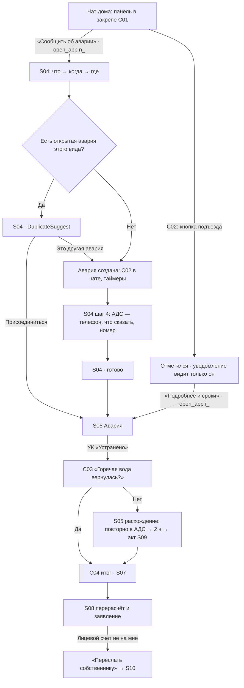
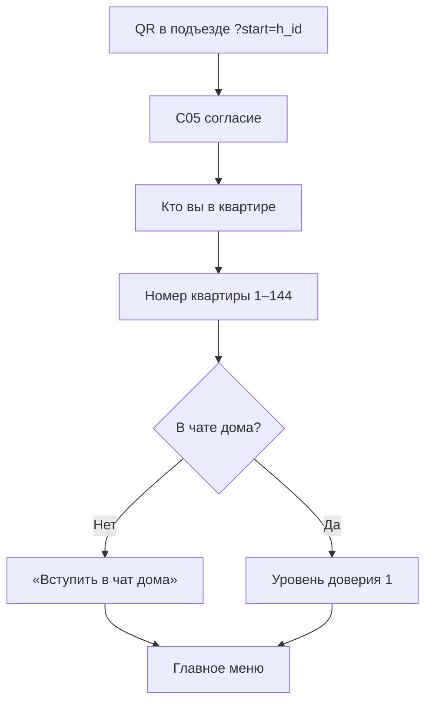
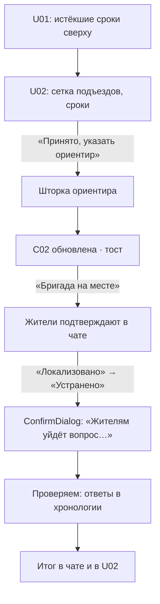
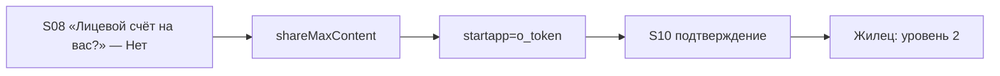

# flows.md — потоки (ТЗ 09, раздел 7)

## 7.1 Житель: авария из чата дома

## 7.2 Житель без чата: QR или личка

## 7.3 УК: от сигнала до итога

## 7.4 Наниматель → собственник

## Прототип коридорного теста
`Prototype.dc.html`: C02 (чат) → «Сообщить об аварии» (C01) → S04 шаги 1–3 → DuplicateSuggest → S05; или C02 → «Подробнее и сроки» → S05. Справа U02 на ноутбуке: «Принято, ориентир» → «Бригада на месте» → «Локализовано» → «Устранено» → в чате C03; ответ «Да» → C04. Счётчики: время до первого действия и число касаний.
